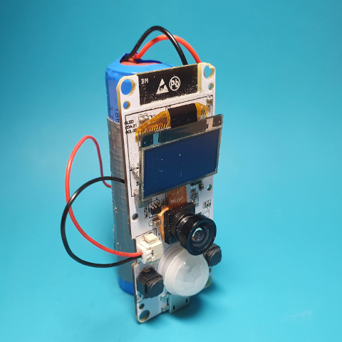

# Introduction

The project make use of popular and cheap ESP32 boards with camera. It takes 
photos when PIR sensor detects motion and transmit it to the server. Alternatively timer or switch can be used
to take photos in specific time intervals. This make it ideal to take pictures of animals, flora or as a security device.

It is optimized for battery use and WiFi transmission, so it must work in the area where WiFi
signal is available. As it uses MQTT to transmit images, MQTT server is required. If WiFi is not available, pictures can be stored on SD card.

## Features

* **Works on popular ESP32 camera boards**
* **Optimized for battery operation**
* **Two modes of operation: PIR/Switch and timer**
* **Supports optional IR illuminator**
* **Seamless integration with Home Assistant**
* **Easy integration with MQTT home automation systems**
* **Python script to store images on disk**
* **SD Card support**
* **Time server support**

## Applications

* **Animal photography**
* **Time elpase photography**
* **Secutiry**

### License

This program is free software: you can redistribute it and/or modify
it under the terms of the GNU General Public License as published by
the Free Software Foundation, either version 3 of the License, or
(at your option) any later version.

# Hardware

Any ESP32 board with camera and extrenal PSI RAM may be used. In addition, the following hardware is required (depending on configuration):

* PIR sensor to activate the camera when movement is detected.
* IR illuminator for night shoots.

## PIR

Any sensor can be used. In some applications it may be usefull to use switch in place of PIR. For 
example, to take photo when doors are open.

It is required that PIR sensor is connected to RTC pad as this is the only way to wake up camera from deep sleep mode.

RTC pins: **0,2,4,12-15,25-27,32-39**

Some boards like TTGO Camera got built-in PIR sensor.

## IR illuminator

Optionally IR illumitation may be used for night photograhy. It is best use one with light sensor, to make sure it works only in low light conditions. Note you must use nightvision camera, most cameras sold uses IR fileter making them usless for night shots.

Because in sleep mode ESP32 does not keep logical state of the pin there are two options to make it working propery:

>:information_source: You cannot connect directly any powerfull LED directly to ESP32 output pin. You must use transistor or other power component to provide enough current for LED.

1. Connect control pin of IR illuminator to RTC pad (pins 0,2,4,12-15,25-27,32-39), that way it is possible to keep its state during sleep.

2. Use extranal circuit to keep off state on control pin of the illuminator. Typically, it is a pull-up or pull-down resistor connected to control pin.

# Theory of operation

Camera stays in sleep mode to preserve energy. It takes pictures only when activated. You can configure activation event as:
* PIR sensor
* Switch or button
* Timer

When camera wakes up, it immiedately start taking pictures. The following options are available:
* How long camera works
* How many pictures it takes
* Delay between pictures

You can combine PIR/Switch and timer activation.
All pictres are stored in internal RAM. When the camera stops taking pictures, it starts transmitting pictures to MQTT server and/or SD Card.

When transmission is finished, device goes to sleep mode.

To receive pictures use ``phototrap_server.py``. It stores all pictures received via MQTT on disk.

## Notes
1. When powered, the camera starts taking pictures imiediately.
2. To speed up transmission you can enable **Start WiFi/MQTT transmission immediately** option. WiFi connection is established in parallel to taking pictures.
3. You can combine PIR/Switch and timer activation. PIR/Switch activation resets timer.

# Configuration

Before compiling program you must run ``idf.py menuconfig`` to set up software to match your hardware configuration.

The most important settings:

1. WiFi and MQTT credentials.

2. GPIO pin where PIR is connected.

3. How many pictures take when the camera is activated. This can be defined by number of pictures or by the total amount of time camera works.

4. Optionally IR illuminator GPIO pin.

## Available options

<pre>               Espressif IoT Development Framework Configuration
    SDK tool configuration  ---&gt;
    Build type  ---&gt;
    Application manager  ---&gt;
    Bootloader config  ---&gt;
    Security features  ---&gt;
    Serial flasher config  ---&gt;
    Partition Table  ---&gt;
<b>    Photo Trap configuration  ---&gt;</b>
    Compiler options  ---&gt;
    Component config  ---&gt;
    Compatibility options  ---&gt;
</pre>

Go to **Photo Trap configuration**.

### Connection WIFI/MQTT

Set WiFi and MQTT options. In addition, status LED may be enabled.
Disable WiFi/MQTT support only when SD Card support is enabled.

### Picture resolution

Set picture resolution. Camera can take more pictures in lower resolution.

## Camera Board

Type of camera board. The program will use different pins to communicate with camera based on this option.

### Operation setup

How often and what number of pictures camera takes.

* **Delay between photos [ms]** – set to 0 for continuos mode; the number of frames per second depends on picture resolution.
* **Maximum working period [s]** – how long camera will work when activated.
* **Maximum number of pictures** – Number of pictures to take when activated.  Set -1 for no limit.
* **Activate camera by the timer** – take picture on regular time intervals. Set -1 to disable. When PIR/Switch is enabled, motion detection resets the timer.
 
 ### Time synchronization

 Synchronize time with NTP server. Make sense only if SD card support is enabled.

 ### Enable SD card support

 When enabled, images are stored on SD Card.

### Enable Home Assistant MQTT discovery

Enables automatic sensor discover in home automation platform [Home Assistant](https://www.home-assistant.io/).

### PIR sensor/Switch

Options to handle PIR sensor or switch.

### IR illuminator

Enable support for infrared illuminator.

# Compilation

The program uses **ESP32 IDF v4.2** enviroment. You must first install it, for more detailed information see [Getting started](https://docs.espressif.com/projects/esp-idf/en/latest/get-started/) guide.

## Configuration

``idf.py menuconfig``

1. Set WiFi and MQTT options
2. Set board type
3. Set PIR options
4. Optionally set timer or SD card options

## Compile

``idf.py build``

## Flash

Write to flash and start monitor.

``idf.py flash monitor``
